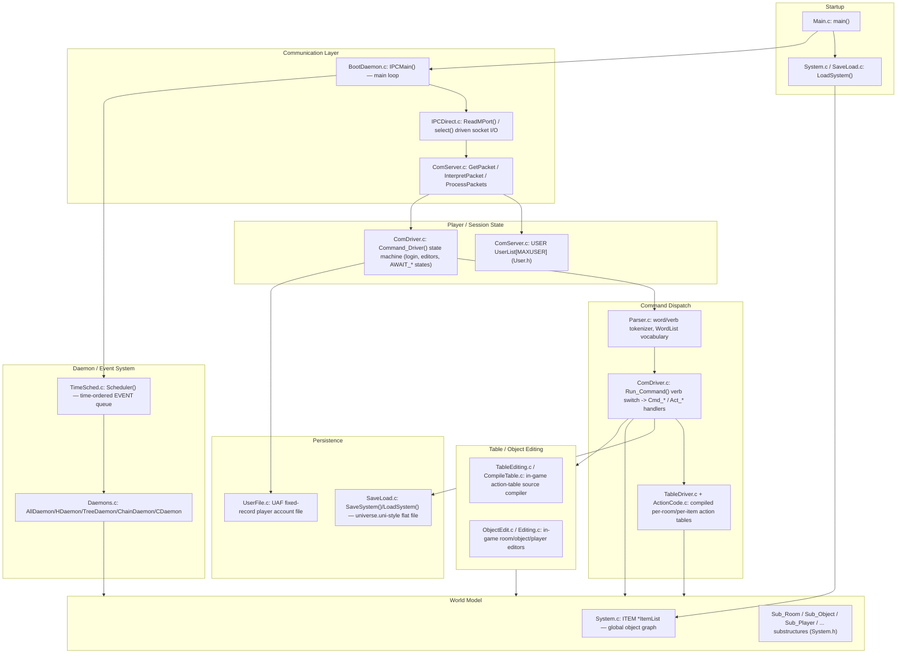

# AberMUD 5.30 — Architecture Overview

> Scope: the "Creator Of Legends" driver, AberMUD release 5.30 (April 2002), as present in this
> repository. This document is descriptive, not aspirational — it records what the code in this
> tree actually does. Where behavior could not be confirmed by reading the code or by running it,
> that is called out explicitly.

See also: [runtime-flows.md](runtime-flows.md) · [communication-protocol.md](communication-protocol.md) ·
[data-model.md](data-model.md) · [command-processing.md](command-processing.md) ·
[persistence.md](persistence.md) · [build-and-run.md](build-and-run.md) ·
[operations.md](operations.md) · [review-findings.md](review-findings.md)

## 1. What this program is

AberMUD is a single-process, single-threaded, event-loop-driven multi-user dungeon (MUD) server
written in ANSI C. One process (`server`, built from `Main.c` + the rest of `CFILES` in
[Makefile](../Makefile)) does everything: it accepts telnet/TCP connections, parses player
commands, runs a small in-house "action" scripting language (compiled game-content tables), models
a persistent object graph (rooms, objects, players, exits, containers, …), schedules timed/daemon
events, and periodically saves/loads that whole object graph to/from a flat binary "universe" file.

There is **no threading and no separate client process** in this build — despite comments in the
code referring to "PLAY processes" and an IPC "port" abstraction (a holdover from an earlier,
multi-process Amiga-era architecture), the Unix/Linux implementation in this tree
([IPCDirect.c](../IPCDirect.c)) fakes that abstraction on top of plain BSD sockets. See
§4 and [communication-protocol.md](communication-protocol.md).

Three auxiliary executables are also built:

| Binary | Source | Purpose |
|---|---|---|
| `server` | `Main.c` + `CFILES` | The MUD server itself |
| `Run_Aber` | [Run_Aber.c](../Run_Aber.c) | Process supervisor that execs and restarts `./server` |
| `Reg` | [Reg.c](../Reg.c) | Offline CLI tool: marks a player record as "registered" (sets `uff_Flag[9]=1`) |
| `FindPW` | [FindPW.c](../FindPW.c) | Offline CLI tool: prints a player's stored password from the `UAF` user file |

The Makefile also references `client`, `Client.c`, `IPCClean.c`, `runaber.c` and `NoProto.h`/
`NoPrototype.h` (a non-ANSI prototype header). **None of these files exist in this repository** —
see [build-and-run.md](build-and-run.md) §"Missing files" for details and the practical
consequences (the `client` target and the `docs` target both fail to build as shipped).

## 2. Executable entry points

- **`server`** — `main()` in [Main.c](../Main.c). This is the real entry point; everything else in
  the architecture hangs off it.
- **`Run_Aber`** — `main()` in [Run_Aber.c](../Run_Aber.c). A tiny supervisor loop: daemonizes,
  then forks/execs `./server` repeatedly, restarting it whenever it exits, with a crude
  "restarted too fast" guard. See [runtime-flows.md](runtime-flows.md) §"Server restart via
  Run_Aber".
- **`Reg` / `FindPW`** — standalone command-line utilities that link directly against
  [UserFile.c](../UserFile.c) and operate on the `UAF` user-account file without going through the
  server at all. They must be run while the server is not writing to the same file, or a race is
  possible (see [review-findings.md](review-findings.md)).

## 3. Major subsystems

### 3.1 Communication layer

Files: [ComServer.c](../ComServer.c), [Comms.h](../Comms.h), [IPCDirect.c](../IPCDirect.c),
[IPC.h](../IPC.h), [LibSocket.c](../LibSocket.c), [Socket.c](../Socket.c) (client-only helper, not
linked into `server`).

`Comms.h` defines the wire-level packet structures (`PACKET`, `COMDATA`, `COMTEXT`) and the
`PACKET_*` message type constants — this is the internal message bus between the "comms layer" and
the "game layer" that historically ran as separate processes. In this build both halves are the
same process; `IPCDirect.c` implements the `PORT`/`Master_Port` abstraction directly over raw
sockets (`select()`-driven, one socket per connected user, plus three always-open listening
sockets — see §5). `ComServer.c` is the dispatcher that turns an incoming `COMTEXT` packet into a
call into the game layer (`Handle_Login`, `Handle_Command`, `Handle_Output`, …).

Full protocol details: [communication-protocol.md](communication-protocol.md).

### 3.2 Player / session state

Files: [User.h](../User.h), [ComServer.c](../ComServer.c) (declares `USER UserList[MAXUSER]`),
[ComDriver.c](../ComDriver.c).

Every connected (or logging-in) player occupies one slot of the fixed-size global array
`USER UserList[MAXUSER]` (`MAXUSER` = 128, [System.h](../System.h)). Each `USER` entry
(`struct User_Entry`, [User.h](../User.h)) carries: the player's display name (`us_Name`), raw
connection identity string (`us_UserName`), a small integer **session state** (`us_State`, one of
the `AWAIT_*` constants — login name/password/sex/email prompts, normal command mode, table/line
editors, object editors, …), a pointer to the connection (`us_Port`), a pointer to the player's
world `ITEM *` once logged in (`us_Item`), and misc per-connection scratch fields
(`us_SysFlags`, `us_UserInfo`, `us_UserPtr`, `us_Record`, `us_Password`, `us_Login`).

`Command_Driver()` in [ComDriver.c](../ComDriver.c) is a straight `switch(state)` state machine:
depending on `us_State` it routes an incoming line of text to the right handler — name entry,
password check, sex/email prompts for new-account registration, the normal command interpreter
(`Run_Command`), or one of several in-game line editors (table editor, object editor, password
change flow). This state machine **is** the login/registration flow and the "what does this input
mean right now" logic for every connection.

### 3.3 Command dispatch

Files: [Parser.c](../Parser.c), [ComDriver.c](../ComDriver.c) (`Run_Command`),
[ActionCode.c](../ActionCode.c), [TableDriver.c](../TableDriver.c), the `Cmd_*` handler files
(`PlyCommand.c`, `ObjCommand.c`, `RoomCommands.c`, `UtilCommand.c`, `TabCommand.c`,
`ContCommand.c`, `GenCommand.c`, `InsAndOuts.c`, …).

Two vocabularies exist simultaneously:

1. **Built-in verbs** — a big, hand-numbered `switch` in `Run_Command()`
   ([ComDriver.c:829](../ComDriver.c)) mapping a parsed verb code to a `Cmd_*` C function (e.g.
   `Cmd_Look`, `Cmd_MoveDirn`, `Cmd_SaveUniverse`, `Cmd_NewItem`, …). These are almost entirely
   world-building / wizard commands (the game itself has essentially no built-in player verbs —
   see [command-processing.md](command-processing.md)).
2. **Data-driven action tables** — `UserAction()` (checked *before* the builtin switch, at
   [ComDriver.c:826](../ComDriver.c)) looks the parsed verb/noun pair up in item-bound or
   global **tables** compiled from the game database. A table is a linked list of `LINE` records
   holding a small bytecode (`ActionCode.c` / `TableDriver.c` interpret it) built by
   `CompileTable.c` from human-readable action-table source the wizards type in through the
   in-game table editor (`TableEditing.c`, `TabCommand.c`). This bytecode interpreter is how all
   actual gameplay (room descriptions, `SAY`, combat, custom verbs, daemons) is implemented — the
   C code supplies primitives (`Act_*` functions in `ActionCode.c`), the table data supplies the
   game logic.

Full flow: [command-processing.md](command-processing.md).

### 3.4 World model

Files: [System.h](../System.h) (struct defs), [System.c](../System.c) (`ItemList`, item
alloc/link/find primitives), [SubHandler.c](../SubHandler.c) (creates/attaches substructures),
[Container.c](../Container.c), [InsAndOuts.c](../InsAndOuts.c), [DarkLight.c](../DarkLight.c),
[Duplicator.c](../Duplicator.c), [Class.c](../Class.c).

Everything in the game world — rooms, objects, players, exits — is one homogeneous `ITEM`
(`struct Item`, [System.h:190](../System.h)), held in a single global singly-linked list
`ItemList` (`System.c`). An `ITEM` also forms a **parent/children/next tree** (its own containment
hierarchy: `it_Parent`, `it_Children`, `it_Next`) so "room contains player contains object" is the
same linkage mechanism used throughout the whole game. What *kind* of item something is (room,
object, player, exit, container, …) is determined not by a type tag but by which **substructures**
(`SUB`-derived structs, e.g. `ROOM`, `OBJECT`, `PLAYER`, `GENEXIT`, `CONTAINER`) are hung off its
`it_Properties` linked list, discriminated at lookup time by a `pr_Key` tag
(`KEY_ROOM`, `KEY_OBJECT`, `KEY_PLAYER`, …, [System.h:488-511](../System.h)). `FindSub()`
(`System.c`) is the universal accessor; `PlayerOf()`, `RoomOf()`, `ObjectOf()`, `ContainerOf()`
(`SysSupport.c`) are typed convenience wrappers. Items also support a lightweight single-inheritance
scheme (`it_Superclass`, `KEY_INHERIT`) used mainly so cloned objects can share tables with their
"master" template. Full struct-by-struct reference: [data-model.md](data-model.md).

### 3.5 Persistence

Files: [SaveLoad.c](../SaveLoad.c), [UserFile.c](../UserFile.c).

Two independent persistence stores:

- **The universe** — the entire `ItemList` graph, all action tables, the word vocabulary, bit-flag
  names, and BSX graphics image data are serialized to/from a single flat binary file by
  `SaveSystem()` / `LoadSystem()` (`SaveLoad.c`). This is what `Main.c` loads at boot
  (`argv[1]`, e.g. `abermud.uni`) and what the in-game `SaveUniverse` command / `Act_ForkDump` /
  admin tooling writes back out.
- **Player accounts** — a separate fixed-record-length file (`UAF`, [System.h](../System.h)
  `USERFILE`) holding one `struct UserFileFormat` (`UFF`, [System.h:566](../System.h)) per
  character: password, stats, flags, table bindings. Read/written by `LoadPersona()` /
  `SavePersona()` / `SaveNewPersona()` (`UserFile.c`), used by login, `Cmd_Password`, death/quit
  handling (`Act_Save`, `Act_KillOff`, `Act_NewText` in `ActionCode.c`), and by the offline `Reg`
  and `FindPW` tools.

Full details, including endianness handling and the two known correctness risks in this scheme:
[persistence.md](persistence.md) and [review-findings.md](review-findings.md).

### 3.6 Daemon / timed-event system

Files: [TimeSched.c](../TimeSched.c), [Daemons.c](../Daemons.c), [BootDaemon.c](../BootDaemon.c).

`TimeSched.c` maintains a single time-ordered singly-linked list of `EVENT` records
(`AddEvent(delay, tableNumber)`, run against `Me()` — see below). `Scheduler()` is called once per
iteration of the main loop (`IPCMain()`, `BootDaemon.c`) and fires every event whose time has come,
by running the referenced action table against the item that scheduled it (`WHEN`-style
game-content timers). `Daemons.c` provides the various *fan-out* primitives content authors use from
inside a table (`ALLDAEMON`/`AllDaemon`, `HDAEMON`/`HDaemon`, `TREEDAEMON`/`TreeDaemon`,
`CHAINDAEMON`/`ChainDaemon`, `CDaemon`) which broadcast a synthetic "daemon verb" invocation to
groups of connected players (everyone, everyone in the same room, everyone contained within an
item, everyone chained to an item, everyone directly inside an item). These always operate only on
logged-in users (`UserList[ct].us_Port && UserList[ct].us_Item`), never on disconnected/idle mobiles,
which is a documented, deliberate CPU-cost tradeoff (see comment at
[Daemons.c:47-60](../Daemons.c)).

Full flow: [runtime-flows.md](runtime-flows.md) §"Timer / daemon event processing".

### 3.7 Table / object editing (in-game content authoring)

Files: [TableEditing.c](../TableEditing.c), [CompileTable.c](../CompileTable.c),
[TabCommand.c](../TabCommand.c), [ObjectEdit.c](../ObjectEdit.c), [Editing.c](../Editing.c).

Wizard-level players (gated by `ArchWizard()` / the `Arch()` macro, [SysSupport.c](../SysSupport.c),
[System.h:585](../System.h)) can edit action tables and object properties **live, over the
telnet/BSX connection**, using dedicated `AWAIT_TEDIT` / `AWAIT_EDLIN` / `AWAIT_OE1`..`AWAIT_OE8`
session states routed by `Command_Driver()`. `CompileTable.c` compiles the human-typed source lines
into the same bytecode format the runtime table interpreter (`ActionCode.c`) executes, and can also
decompile a table back to source text for display. This is effectively AberMUD's built-in scripting
IDE.

### 3.8 BSX graphics extension

Files: [BSX.c](../BSX.c), plus BSX-aware branches in [IPCDirect.c](../IPCDirect.c) and
[ComServer.c](../ComServer.c).

An optional, always-compiled-in extension protocol for the historical "BSXmud" graphical client. A
third listening socket (`BsxFD`, `SysPort+2`) is dedicated to BSX-mode connections; the per-user
`UserState[u]==2` flag switches formatting/echo behavior for that connection throughout
`IPCDirect.c`. `BSX.c` manages a list of hex-encoded image blobs (`BSXImage`) that can be loaded
from disk by a wizard (`Cmd_LoadBSX`) and pushed to BSX clients as `@SCE`/`@RMO`/`@VIO`/`@DFS`/`@DFO`
control sequences embedded in otherwise-normal output text. Full protocol notes:
[communication-protocol.md](communication-protocol.md) §"BSX sub-protocol".

## 4. Historical context that still shapes the code

The comms layer's vocabulary — "PORT", "Master_Port", `WriteMPort`/`ReadMPort`,
`AssignService`/`FindService`, the `PACKET`/`COMDATA`/`COMTEXT` framing, `IPC.h`'s
`PORT_SYSKEY`/`AMIGA_OLD` conditional struct — is inherited from an earlier AberMUD architecture
(explicitly Amiga Exec message-port based, per `#ifdef AMIGA_OLD` in [IPC.h](../IPC.h)) where the
telnet-handling front end and the game engine really were separate cooperating processes/tasks
communicating over message ports. **In this Unix build that separation is gone**: `IPCDirect.c`'s
`CreateMPort`/`Bind_Port`/`ReadMPort`/`WriteMPort` are a same-process shim that fakes the old
port API on top of `select()` and raw sockets, keyed by file descriptor (`FindUserFD`) rather than
by any real IPC handle. Understanding this explains why the code reads as if network I/O were an
external, addressable service even though there is only one process and one thread.

`Run_Aber.c`'s "SUPERCEDE" logic (`ComServer.c`'s `PACKET_SUPERCEDE`/`SupercedeFlag`, and the
`MYTHOS` service-name lookup in `BootDaemon.c`'s `IPCMain()`) is another remnant of that world: on
`FindService("MYTHOS")` (`IPCDirect.c` — this call is stubbed to always return `NULL` in this build)
a genuinely IPC-connected old server instance would have been told to shut down gracefully. Because
`FindService`/`AssignService` are no-ops here, that hand-off logic is effectively dead code on Unix
— confirmed by reading `IPCDirect.c:547-549`.

## 5. Important global structures and ownership

| Global | Declared in | Owner / lifetime | Notes |
|---|---|---|---|
| `USER UserList[MAXUSER]` | [ComServer.c](../ComServer.c) | Process lifetime, fixed-size array | One slot per possible connection; `us_State==AWAIT_LOGIN` (0) marks a free slot. `MAXUSER=128` ([System.h](../System.h)). |
| `ITEM *ItemList` | [System.c](../System.c) | Process lifetime, grows/shrinks as items are created/freed | The entire persistent world graph. Rebuilt wholesale by `LoadSystem()` at boot. |
| `WLIST *WordList` | [Parser.c](../Parser.c) | Process lifetime | Vocabulary (verbs/nouns/adjectives/prepositions/pronouns/ordinals/noise words), sorted by code. Populated by the in-game `INIT` bootstrap sequence in `Run_Command()` and by `AddWord`/`AddVerb`/etc admin commands; saved/loaded with the universe. |
| `EVENT *EventList` (static) | [TimeSched.c](../TimeSched.c) | Process lifetime | Time-ordered pending-timer queue; **not persisted** across save/load (see [persistence.md](persistence.md)). |
| `PORT *Master_Port` | [BootDaemon.c](../BootDaemon.c) | Process lifetime | The listening-socket handle returned by `CreateMPort`; all incoming packets are read through it. |
| `BSXImage *BSXImageList` (static) | [BSX.c](../BSX.c) | Process lifetime | Loaded BSX graphics blobs; persisted with the universe (`SaveBSXImages`/`LoadBSXImages`). |
| `jmp_buf Oops` | [BootDaemon.c](../BootDaemon.c) | Process lifetime | `setjmp` target used as a coarse "abort this command/event and return to the main loop" error-recovery mechanism — see §6. |
| Three listening sockets: main / "alt" / BSX | [IPCDirect.c](../IPCDirect.c) `CreateMPort` | Process lifetime | Bound to `SysPort`, `SysPort+1`, `SysPort+2` respectively (`SysPort` default `TCP_PORT`=5000, overridable with `-p`). Purpose of the "alt" port beyond an equivalent plain-telnet entry point is not documented in-code — **unconfirmed / needs verification**. |

Ownership is almost entirely **global, unsynchronized, single-threaded** — there is no locking
anywhere in this codebase because there is only one thread of execution; the entire model works
only because the main loop is strictly single-threaded and re-entrant calls are prevented by
program structure rather than by any mutual exclusion primitive.

## 6. Crash / error recovery model

`ErrFunc()` (`System.c`, invoked via the `Error(x)` macro used pervasively for "this should never
happen" assertions) is effectively AberMUD's own crash handler: on first invocation post-boot it
force-logs out every connected user, attempts to `DisintegrateAll()` (clean up dangling records)
twice, tries to `SaveSystem("gonebang.uni")` as an emergency dump, and then calls `exit(1)`. A
`setjmp(Oops)`/`longjmp(Oops,1)` pair (set in `Run_Command()` and `IPCMain()`'s loop, thrown from
`TableDriver.c` on table/stack-depth problems) provides a *softer* recovery path that unwinds out of
a single misbehaving player command or table execution without killing the whole process. `Main.c`
also installs raw `SIGSEGV`/`SIGBUS`/`SIGFPE` handlers that log and then `abort()` — i.e. segfaults
still crash the process (and, on typical Unix configurations, dump core) after being logged; they do
not trigger the `gonebang.uni` rescue path because they don't go through `Error()`.
**Unconfirmed / needs verification at runtime**: whether `abort()` inside a signal handler that
itself may run on a corrupted stack reliably produces a usable core dump on modern Linux — this is
plausible but was not exercised in this review.

## 7. Confirmed vs. inferred vs. unclear

**Confirmed by reading the code and/or building & running it in this review:**
- Entry points, subsystem boundaries, and the flows above (verified by tracing calls and, for
  startup/login/oversized-input handling, by building the project and exercising it locally —
  see [build-and-run.md](build-and-run.md) and [review-findings.md](review-findings.md)).
- The Makefile references source files (`Client.c`, `runaber.c`, `IPCClean.c`) and a `DOC/`
  directory that do not exist in this repository, and `NoProto.h` exists but is not the header
  actually included (`Prototype.h` is, via the `ANSI_C` branch in `System.h`).

**Inferred from code structure and comments, not independently verified against original AberMUD
documentation:**
- The "PLAY process" / Amiga message-port heritage described in §4.
- The purpose of the "alt" socket (`SysPort+1`) — no distinguishing protocol logic was found for it
  in `IPCDirect.c`/`ComServer.c` beyond it being a second `accept()`-able entry point; it is treated
  identically to the main port by `MakeConnection()`.

**Unclear / would need runtime verification or access to original release notes:**
- Whether AmigaDOS/`AMIGA_OLD` codepaths (`IPC.h`, `Amiga.c`) still build at all — they are
  Amiga-Exec-specific and cannot be exercised on this platform.
- Full behavior of the RWHO integration (`LibRwho.c`, `AberRwho.c`) since it depends on an external
  `rwhod`-compatible service not present in this environment.
