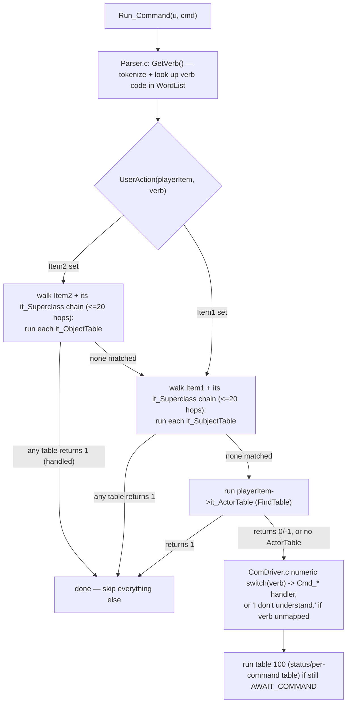

# AberMUD 5.30 — Command Processing

Back to [architecture.md](architecture.md). Related: [runtime-flows.md](runtime-flows.md),
[data-model.md](data-model.md).

## 1. Two layers of "commands"

AberMUD dispatches a parsed player command through **two independent mechanisms**, tried in a fixed
order, from `Run_Command()` ([ComDriver.c:582](../ComDriver.c)):

1. **Data-driven action tables** (`UserAction`, [TableDriver.c:873](../TableDriver.c)) — tried
   first. If any bound table produces a match, the built-in C switch is skipped entirely.
2. **Built-in C verb switch** — a ~90-case numeric `switch(v)` in `Run_Command`
   ([ComDriver.c:829-986](../ComDriver.c)) mapping verb codes to `Cmd_*` functions. This is
   overwhelmingly **world-building/administration tooling** (create/delete items, set flags, edit
   tables, manage exits, wizard debugging) plus the twelve movement directions — there is
   essentially no built-in "gameplay" verb (no `get`, `drop`, `say`, `attack`, …) in the C layer;
   those are expected to be implemented as content in action tables, using the large `Act_*`
   primitive library in [ActionCode.c](../ActionCode.c) (177 `Act_*`/action entry points, covering
   item manipulation, arithmetic on flags, text output, daemon fan-out, save/load hooks, BSX
   control, RWHO announcements, etc.).

This means **object/subject/actor tables can fully override or intercept any built-in verb**,
including movement and admin commands — a room or object's own table gets first refusal on every
command a player standing in/holding it issues.

## 2. Parsing (`Parser.c`)

- `GetVerb()` tokenizes the current word (`BreakWord`, skipping `WD_NOISE` words) and looks it up in
  the global sorted `WordList` as `WD_VERB`; unrecognized text yields verb code `-1`
  ("Sorry, But I don't recognise that verb.").
- **Autoverb / pronoun context** (`PCONTEXT`, per-user, `ParserData[MAXUSER]`): after a command
  resolves `$1`/`$2`/`$AC` item references, `SetItData()` records them into `pa_It`/`pa_Them`/
  `pa_Him`/`pa_Her`/`pa_There` slots (gendered by the target's `PL_MALE`/`PL_FEMALE` flags) so a
  following bare command with the same verb pending (`GetContext(u)->pa_Verb>0`) or an "it/them/him/
  her/there" pronoun in the next command resolves against the last-referenced item, without the
  player re-typing the noun.
- Multi-phrase input: `.`, `;`, `,` and the literal words `AND`/`THEN` all terminate a phrase
  (`BreakWord`), letting one line express a sequence of separate command phrases; `FNxPhrs` is used
  by callers that need to walk phrase-by-phrase (e.g. `AND`-joined destination lists in `SET`-like
  commands).
- Special one-character tokens `: " / '` are always returned as their own single-character "word",
  used as parser escape hatches — `:` at the very start of a whole command line specifically means
  "ArchWizard bypass" (see below), independent of this generic tokenizer rule.
- `#<n>` disambiguation: `FindSomething()` ([SysSupport.c](../SysSupport.c)) lets an editing command
  reference the *n*-th ambiguous match for a noun/adjective pair (`#2 sword` = the second sword
  found) rather than always the first.

## 3. Action-table bytecode (`CompileTable.c` / `ActionCode.c` / `TableDriver.c`)

Action-table **source** is authored in-game via the table editor (`TableEditing.c`, `TabCommand.c`)
by `ArchWizard()` players, or bulk-loaded (`LoadTable`, verb `58`). `CompileTable.c` compiles each
source line into a `LINE` (matching `verb`/`noun1`/`noun2`, `-1`/wildcard supported) plus a flat
`unsigned short[]` bytecode buffer (`li_Data`) referencing `Act_*` C functions and literal operands
(numbers, text, and packed `ITEM*` pointers — see [persistence.md](persistence.md) for how those
pointers are encoded). The same file can also **decompile** a `LINE` back to editable source text,
which is what the in-game table editor displays when a wizard opens an existing table.

`ExecTable()` ([TableDriver.c:296](../TableDriver.c)) walks a table's `LINE` list, running each line
whose verb/noun pattern matches the current parse context (`ArgMatch`); a **recursion guard**
(`TCount`, capped at 40) protects against runaway table→table calls (e.g. a `DAEMON` action whose
target's table calls back into the original), unwinding via `longjmp(Oops,1)` straight back to
`Run_Command`'s or `IPCMain`'s `setjmp` — see [runtime-flows.md](runtime-flows.md) §6/main-loop.

`UserAction()`'s superclass walk is itself bounded to 20 hops per side (`ct<20` on both the
`it_ObjectTable`/`it_SubjectTable` searches, [TableDriver.c:882-899](../TableDriver.c)) — this is a
second, independent safety limit distinct from the 40-deep `ExecTable` recursion counter, guarding
against a superclass cycle rather than table-call recursion. **Neither limit validates that the
superclass chain is acyclic up front** — both simply stop after N hops, which prevents an infinite
loop but means a genuinely cyclic superclass chain silently truncates lookup rather than being
diagnosed. This is a robustness note, not a demonstrated crash.

**64-bit fail-closed note**: `CompileTable.c`'s literal item/text pointer packer now rejects (rather
than silently truncating) any operand whose address doesn't fit the bytecode's packed 32-bit
representation, and `SaveLoad.c`'s loader warns on the same condition. Since a normal heap pointer on
a 64-bit build routinely has nonzero bits above bit 31, this means `EditTable`/`LoadTable` reject most
table lines containing a literal item reference or a text/message operand outright on 64-bit
servers — which is most real action-table content. This is deliberate, fail-closed behavior, not a
regression; see [review-findings.md](review-findings.md) H2 for the full rationale and the
ordinal-based bytecode redesign that would actually resolve it.

## 4. Built-in verb catalog (selected; full table is the `switch` at [ComDriver.c:829](../ComDriver.c))

Grouped by function (verb codes from the `AddWord(..., N, WD_VERB)` calls in the `INIT` bootstrap,
[ComDriver.c:606-762](../ComDriver.c)):

| Range | Examples | Purpose |
|---|---|---|
| 1–13 | `Abort`, `AddVerb`, `AddNoun`, `AddAdj`, `AddPrep`, `AddPronoun`, `AddOrdinate`, `II` (item info), `ListItems`, `SetName`, `Set` (state), `Create`, `Delete` | Vocabulary and raw item management |
| 14–19 | `BeRoom`, `BeObject`, `BePlayer`, `UnRoom`, `UnObject`, `UnPlayer` | Attach/detach the core substructures |
| 20 | `SaveUniverse` | Trigger `SaveSystem()` — see [persistence.md](persistence.md) |
| 21–35 | `StatMe`, `SetShort`, `ShowRoom`, `SetRFlag`, `SetLong`, `Look`, `Goto`, `Brief`, `Verbose`, `ShowObject`, `SetOFlag`, `SetDesc`, `Invisible`, `Visible`, `Say` | Room/object inspection and editing, plus the one built-in social verb (`Say`) |
| 36–54 | `Place`, `ListWord`, `Del*` (word deletion), `NewExit`/`DelExit`, `OSize`/`OWeight`, `ShowPlayer`, `SetPFlag`, `SetPSize`/`SetPWeight`/`SetPStrength`/`SetPLevel`/`SetPScore` | Exit and player-stat administration |
| 55–71 | `Users`, `ListTables`, `DeleteTable`, `LoadTable`, `EditTable`, `NewTable`, `Quit`, `Chain`/`UnChain`, `Rename`, `SaveTable`, `SetActor`/`SetAction`, `BeContainer`/`UnContainer`, `SetVolume`, `ShowContainer` | Table lifecycle, session teardown, container setup |
| 72–99 | `MessageExit`, `SetCFlag`, `SetUFlag`, `SetUItem`, `ShowUser`, `SetPicture`, `Share`/`UnShare`, `Status`, `Name*Flag`/`Un*Flag`/`List*Flags`, `DoorPair`, `SetFlag`, `SetPerception`, `ShowAllRooms`/`ShowAllObjects`/`ShowAllPlayers`, `EditObject` | Flag-name registries, bulk listing/audit commands |
| 100–111 | `North`…`SouthWest`, `In`, `Out` | The twelve movement directions (`Cmd_MoveDirn`) |
| 150–180 | `ListClass`/`NameClass`/`SetClass`/`UnsetClass`, `TrackFlag`/`UnTrackFlag`/`ListTrack`, `Debugger`, `FindItem`/`FindFlag`, `Exorcise`, `NameTable`, `Name*Flags`/`List*Flags` (per-substructure bit names), `Which`, `EditOTable`/`EditSTable`/`CondExit`, `EditDTable`, `SetSuper`/`ShowSuper`, `*BSX` (delete/load/list/show) | Second-generation admin/debug tooling, class system, BSX asset management |

`GetVerb` results outside these ranges fall to `default: SendItem(i,"I don't understand.\n")`.

## 5. Wizard privilege model

`ArchWizard()` / the `Arch(x)` macro ([SysSupport.c](../SysSupport.c),
[System.h:585](../System.h)) is the sole privilege check gating nearly every admin verb and the
`:` command-bypass. It is **name-based, not account-flag-based**: an item is a wizard iff its
current display name case-insensitively matches one of seven hardcoded literals — `"Anarchy"`,
`"Debugiit"`, and the five `BOSS1`..`BOSS5` build-time constants (`System.h`: `Arashi`, `Hobbit`,
`Debugger`, `Bonzo`, `:Boss`) — **or** (via the `Arch()` macro specifically, not `ArchWizard()`
itself) the item's name matches the hardcoded author credit string `CPRT` ("Alan Cox"). See
[review-findings.md](review-findings.md) for the security implications of name-based privilege.

## 6. New player / status / autoboot tables (well-known table numbers)

Confirmed by direct call sites:

| Table # | Trigger | Source |
|---|---|---|
| `1` | Once, at boot (`AddEvent(0,1)`) | [Main.c:141](../Main.c) |
| `100` | After every command, while still `AWAIT_COMMAND` | [ComDriver.c:990](../ComDriver.c) |
| `101` | Once, right after a brand-new persona is created (`CreatePersona`) | [ComDriver.c:571](../ComDriver.c) |
| `102` | Once, right after an existing persona successfully logs in (`Check_Password`) | [ComDriver.c:435](../ComDriver.c) |

These numbers are a convention enforced only by these specific call sites — there is no naming
registry preventing game content from also using tables 1/100/101/102 for unrelated per-item
purposes; the numbers only carry special meaning when referenced by the specific C call sites above.

## 7. Confirmed vs. unclear

**Confirmed**: dispatch order, recursion/loop guards and their bounds, the wizard-name privilege
check and its literal name list, the well-known table numbers and their triggers.

**Unclear / needs verification**: whether `BOSS5` (`":Boss"`) is deliberately excluded from
`ArchWizard()` or a latent inconsistency; the complete semantic behavior of every one of the 177
`Act_*` primitives was not individually verified at runtime in this review — only the ones directly
implicated in the findings below were exercised or traced in depth.
