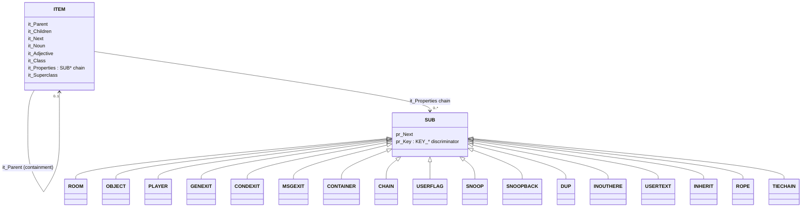

# AberMUD 5.30 — Data Model

Back to [architecture.md](architecture.md). Related: [persistence.md](persistence.md),
[command-processing.md](command-processing.md).

All structure definitions referenced here live in [System.h](../System.h) unless noted; the session
struct lives in [User.h](../User.h).

## 1. The item graph

Everything placeable in the world — a room, an object, a player, an exit stub — is one `ITEM`
(`struct Item`, [System.h:190-217](../System.h)):

```c
struct Item {
    struct Item *it_MasterNext;  /* global list linkage (ItemList) */
    struct Item *it_Parent;      /* containing item, NULL = "the void" (unplaced) */
    struct Item *it_Children;    /* first item this one contains */
    struct Item *it_Next;        /* next sibling within the same parent */
    short  it_Noun, it_Adjective;/* vocabulary reference — identifies the item to players */
    short  it_ActorTable;        /* table run when THIS item is the actor (player/mobile) */
    short  it_ActionTable;       /* table run as this item's personal daemon/status handler */
    short  it_Users;             /* reference/lock count — see "lifecycle" below */
    short  it_State;             /* item's numeric state (object text variant, door open/closed, ...) */
    short  it_Class;             /* bitmask, see Class.c */
    short  it_Perception;        /* visibility threshold; -1 == "pending deletion" sentinel */
    TPTR   it_Name;              /* display name (a strdup'd C string, despite the TXT abstraction) */
    SUB   *it_Properties;        /* linked list of typed substructures — see below */
    struct Item *it_Superclass;  /* single-inheritance link (KEY_INHERIT-adjacent, for clones) */
    TABLE *it_ObjectTable, *it_SubjectTable, *it_DaemonTable;  /* per-item bound action tables */
    short  it_Zone;              /* item "zone" tag, new in 5.30 — no consuming logic located in this review; unconfirmed */
};
```

- **Containment** is one intrusive tree threaded through `it_Parent`/`it_Children`/`it_Next` — the
  same three pointers represent "room contains player", "player carries object",
  "bag contains item", etc. `O_FREE(x)` (`it_Parent==NULL`) means "in the void" (unplaced,
  typically mid-move or freshly created).
- **Identity/lookup** is by `(it_Adjective, it_Noun)` vocabulary-code pairs, not by name string —
  `FindMaster`/`NextMaster`/`FindIn`/`NextIn`/`FindInByClass` (`System.c`) all match on these codes.
  A player's own name becomes a dynamically-registered noun word (`AddWord(name, 10000+u, WD_NOUN)`,
  [ComDriver.c:399](../ComDriver.c)) at login — player noun codes are conventionally
  `10000 + <user slot>`.
- **Lifecycle**: `CreateItem`/`FreeItem` (`System.c`). `FreeItem` refuses to run unless the item is
  simultaneously unlocked (`it_Users==0`), empty (`O_EMPTY`), has no attached substructures, and is
  unlinked (`O_FREE`) — callers (`RemoveUser`, `ExitUser`, delete commands) must tear those down in
  the right order first. `it_Perception=-1` is used as a **deferred-delete flag**: `UnlockItem`
  checks it and finishes the free once the last lock drops (`System.c:299-309`), which is how a
  player item that still has a pending timer event against it (locked via `AddEvent`/`LockItem`) is
  safely destroyed only once that timer has fired or been cancelled.
- **Class bitmask** (`it_Class`, up to 16 named bits, `Class.c`) is a coarse, author-defined tagging
  system used by `FindInByClass`/daemon-table matching, independent of the noun/adjective identity
  system.



## 2. Substructures (`Sub_*`) — "what kind of thing is this item"

Every substructure begins with a `SUB` header (`pr_Next`, `pr_Key`) so a generic linked list
(`it_Properties`) can hold a heterogeneous mix, discriminated by `pr_Key` at lookup time
(`FindSub`/`NextSub`, `System.c`). An item can carry multiple substructures simultaneously (e.g. a
room is typically `ROOM` + optionally `CONTAINER`; a player is `PLAYER` + often `USERFLAG`).

| Struct | Key | Fields of note | Role |
|---|---|---|---|
| `ROOM` (`Sub_Room`) | `KEY_ROOM` | `rm_Short`/`rm_Long` text, `rm_Flags` (`RM_DARK`, `RM_OUTSIDE`\*obsolete, `RM_DEATH`, `RM_MERGE`, `RM_JOIN`, `RM_DROPEMSG`) | Marks an item as a room; short/long description text |
| `OBJECT` (`Sub_Object`) | `KEY_OBJECT` | `ob_Text[4]` (per-state description text), `ob_Size`/`ob_Weight` overrides, `ob_Flags` (`OB_FLANNEL`, `OB_NOIT`, `OB_WORN`, `OB_DESTROYED`\*obsolete, `OB_CANGET`, `OB_CANWEAR`, `OB_LIGHTSOURCE`, `OB_LIGHT0`, `OB_NOSEECARRY`) | Marks an item as a pick-up-able/describable object |
| `PLAYER` (`Sub_Player`) | `KEY_PLAYER` | `pl_UserKey` (index into `UserList[]`, or `-1` for a mobile/NPC), `pl_Size`/`pl_Weight`/`pl_Strength`, `pl_Flags` (`PL_MALE`/`PL_FEMALE`/`PL_NEUTER`/`PL_CONFUSED` share `PL_SEXBITS`; `PL_BRIEF`, `PL_BLIND`, `PL_DEAF`), `pl_Level`, `pl_Score` | Marks an item as playable/animate; `pl_UserKey==-1` is how NPCs reuse the exact same player machinery |
| `GENEXIT` (`Sub_GenExit`) | `KEY_GENEXIT` | `ge_Dest[12]` — one destination `ITEM*` per compass/vertical/in/out direction | Simple directional exit table |
| `CONDEXIT` (`Sub_CondExit`) | `KEY_CONDEXIT` | `ce_Dest`, `ce_Table`, `ce_ExitNumber` | An exit gated by running a condition table first |
| `MSGEXIT` (`Sub_MsgExit`) | `KEY_MSGEXIT` | `me_Dest`, `me_Text`, `me_ExitNumber` | An exit that emits custom text when used |
| `CONTAINER` (`Sub_Container`) | `KEY_CONTAINER` | `co_Volume`, `co_Flags` (`CO_SOFT`, `CO_SEETHRU`, `CO_CANPUTIN`, `CO_CANGETOUT`, `CO_CLOSES`, `CO_SEEIN`), `co_ConText` | Marks an item as able to hold other items with capacity/visibility rules |
| `CHAIN` (`Sub_Chain`) | `KEY_CHAIN` | `ch_Chained` | Links this item to another for `ChainDaemon`/`Cmd_Chain` purposes |
| `USERFLAG` / `USERFLAG2` (`Sub_UserFlag`) | `KEY_USERFLAG` / `KEY_USERFLAG2` | `uf_Flags[8]` (numeric), `uf_Items[8]` (item refs) | Generic per-item scratch storage used heavily by game-content authors (combat state, quest flags, etc.); two parallel banks of 8 give 16 numeric + 16 item flags total per item |
| `SNOOP` (`Sub_Snoop`) | `KEY_SNOOP` | `sn_Snooper`, `sn_BackPtr`, `sn_Ident` (`SN_PLAYER`, `SN_PLACE`\*not implemented, `SN_GLOBAL`\*documented as buggy) | Attached to the *snooped* item |
| `SNOOPBACK` (`Sub_SnoopBack`) | `KEY_SNOOPBACK` | `sb_Snooped`, `sb_SnoopKey` | Attached to the *snooper's* item, back-reference pairing |
| `DUP` (`Sub_Dup`) | `KEY_DUPED` | `du_Master` | Marks a clone, pointing at its template item (see `Duplicator.c`) |
| `INOUTHERE` (`Sub_InOutHere`) | `KEY_INOUTHERE` | `io_InMsg`/`io_OutMsg`/`io_HereMsg` | Custom movement-message overrides |
| `USERTEXT` (`Sub_UserText`) | `KEY_USERTEXT` | `ut_Text[8]` | 8 free-form text slots for content authors |
| `INHERIT` (`Sub_Inherit`) | `KEY_INHERIT` | `in_Master` | Non-nested single inheritance: `FindSub` falls back to the master's properties if not found locally and the world has finished booting (`post_boot`) |
| `ROPE` / `TIECHAIN` | `KEY_ROPE` / `KEY_TIECHAIN` | — | **Explicitly marked "not currently supported" / "Reserved - unused" in the header comments.** Struct and key values are reserved but the feature is inactive — confirmed by comment, not by exhaustive code search for all call sites. |
| `Tag_Generic`/`Sub_Generic` | `TAGID_*` | Variable-length tagged data | A generic extensible-tag substructure scaffold "new in 5.30"; **no consumer of `Sub_Generic` was found during this review — status unconfirmed, needs verification.** |

Key-id allocation policy (documented in-code, [System.h:479-511](../System.h)): IDs 18–63 are
reserved for future system use; custom/third-party substructures should use 64–254; `KEY_INHERIT`
is pinned at 255. `KEY_BACKTRACK` (10) is marked obsolete/unused.

## 3. Word list / vocabulary (`WLIST`, [System.h:168-177](../System.h))

```c
struct WordList { char *wd_Text; short wd_Type; short wd_Code; struct WordList *wd_Next; };
```

A single global, code-sorted, singly-linked list (`WordList`, `Parser.c`) holding every recognized
word across all categories (`WD_NOUN`, `WD_PREP`, `WD_PRONOUN`, `WD_CLASS`, `WD_VERB`, `WD_ADJ`,
`WD_NOISE`, `WD_ORDIN`; [System.h:513-520](../System.h)). Verb/noun/adjective **codes**, not text, are
what the rest of the engine actually operates on (item identity, action-table matching, the
`Run_Command` verb switch); text is only used for parsing input and rendering names back to players.
Player names become `WD_NOUN` entries dynamically at login/creation and are removed by `FreeWord` at
logout — see [review-findings.md](review-findings.md) for a confirmed defect in that removal path.

## 4. Action tables (`TABLE`/`LINE`, [System.h:534-552](../System.h))

```c
struct Line  { short li_Verb, li_Noun1, li_Noun2; unsigned short *li_Data; LINE *li_Next; };
struct Table { short tb_Number; LINE *tb_First; TABLE *tb_Next; TXT *tb_Name; };
```

A `TABLE` is a numbered, named collection of `LINE`s; each `LINE` matches on
`(verb, noun1, noun2)` (`-1`=wildcard, per the `li_Verb`/`Noun1`/`Noun2` convention used throughout
the parser) and, if matched, runs its `li_Data` bytecode — a flat array of 16-bit opcodes/operands
compiled by `CompileTable.c` from human-authored action-table source and interpreted by
`ActionCode.c`/`TableDriver.c`. Full dispatch details: [command-processing.md](command-processing.md).
Tables can be free-standing (global, looked up by number via `FindTable`) or bound directly to an
item (`it_ObjectTable`/`it_SubjectTable`/`it_DaemonTable`).

## 5. Player account record (`UFF`, persisted separately from the universe)

```c
struct UserFileFormat {           /* User.h / System.h, on-disk in the UAF file */
    char  uff_Name[32];           /* NOTE: allocated at 32 regardless of MAXNAME, for cross-machine compat */
    short uff_Perception, uff_ActorTable, uff_ActionTable;
    short uff_Size, uff_Weight, uff_Strength, uff_Flags, uff_Level;
    long  uff_Score;
    char  uff_Password[8];
    long  uff_Flag[10];
    char  uff_Reserved[28];       /* reserved for future userflag expansion */
};
```

This is the fixed-length record `UserFile.c` reads/writes directly to/from the `UAF` file — see
[persistence.md](persistence.md) for the byte-order handling and file layout.

## 6. Session record (`USER`, [User.h](../User.h)) — in-memory only, never persisted directly

```c
struct User_Entry {
    char  us_Name[MAXNAME+1];      /* MAXNAME=14, System.h */
    char  us_UserName[MAXUSERID+1];/* MAXUSERID=32, raw connection identity e.g. "Internet:1.2.3.4" */
    short us_State;                /* AWAIT_* */
    short us_Flags;
    PORT *us_Port;                 /* the live connection, or NULL if this slot is idle/free */
    ITEM *us_Item;                 /* the player's world ITEM once logged in, else NULL */
    short us_SysFlags[32];         /* scratch */
    short us_UserInfo;              /* two-purpose scratch for state handlers */
    char *us_UserPtr;               /* scratch pointer — e.g. holds a malloc'd pending-password buffer during AWAIT_PWNEW */
    long  us_Record;                /* UAF record index for this persona, or -1 if not yet persisted */
    char  us_Password[8];
#ifdef ATTACH
    ITEM *us_RealPerson;            /* set while "attached" to a mobile, see ExitLogic.c/ATTACH feature */
#endif
    long  us_Login;                 /* login timestamp */
};
```

`UserList[MAXUSER]` (`ComServer.c`) is the single array of these; slot index doubles as the "user
number" used pervasively elsewhere (`pl_UserKey`, event runners, daemon iteration, `SendUser(u,…)`
etc). `us_State==AWAIT_LOGIN` (0) is the sentinel meaning "this slot is free" **only when
`us_Name[0]==0` also holds** — `Handle_Login`'s free-slot scan checks `us_Name[0]==0` specifically
([ComServer.c:158](../ComServer.c)), not `us_State`, since `AWAIT_COMMAND` also equals 0.

## 7. Confirmed vs. unclear

**Confirmed** by reading `System.h`/`User.h` directly and cross-referencing consuming code in
`SubHandler.c`, `System.c`, `SysSupport.c`.

**Unclear / unconfirmed, flagged above inline:** the runtime role of `it_Zone` (new in 5.30, no
consumer located), whether `Sub_Generic`/tag-based substructures have any live producer/consumer in
this codebase version, and the exact intended use of `ROPE`/`TIECHAIN` beyond "reserved, not
implemented" per their own header comments.
