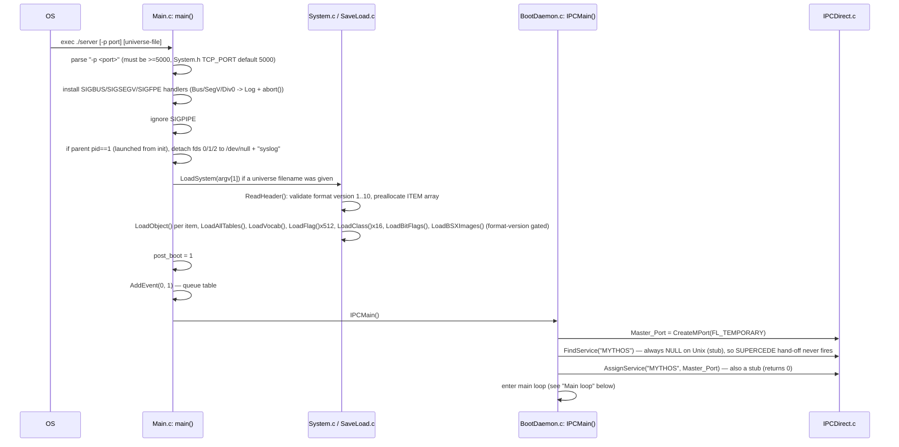
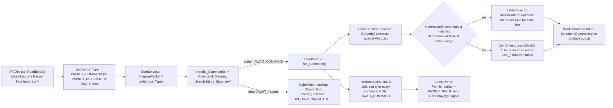
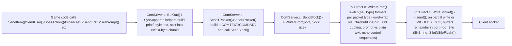

# AberMUD 5.30 — Runtime Flows

Back to [architecture.md](architecture.md). Related: [communication-protocol.md](communication-protocol.md),
[command-processing.md](command-processing.md), [persistence.md](persistence.md).

Every flow below cites the concrete file/function/line it was traced from. Flows marked
**(runtime-verified)** were additionally exercised by building the project and driving the live
`server` binary over TCP during this review (see [build-and-run.md](build-and-run.md)); everything
else is verified by static reading only.

## 1. Server startup and universe loading **(runtime-verified)**



- **If no universe file argument is given, `LoadSystem` is never called** and the server boots with
  an empty `ItemList` / `WordList` — confirmed by reading `Main.c:118-123` (`if(argv[1])` guards the
  whole load). This is a legitimate way to bootstrap a brand-new game from nothing but action-table
  commands, not necessarily a bug, but it means "server starts with zero content" is expected,
  documented behavior, not a crash.
- `AddEvent(0,1)` ([Main.c:141](../Main.c)) schedules table `1` to run on the very first
  `Scheduler()` pass of the main loop — this is the conventional "autoboot"/initialization table
  hook that game content authors use to set up any first-run state. Table `100` is the
  "run after every command" status table and `101`/`102` are new-player-creation hooks — see
  [command-processing.md](command-processing.md).
- **Runtime-verified in this review**: the server built from this tree does start, bind three
  listening sockets, log `Startup Commenced` / `Startup Completed` / `IPC Server Starting` to
  `Creator.log`, and accept a first connection, using a repository build described in
  [build-and-run.md](build-and-run.md).

### Main loop (`IPCMain`, [BootDaemon.c](../BootDaemon.c))

```c
while(1) {
    setjmp(Oops);        /* recover here if a command/table blows the stack */
    Scheduler();          /* fire due timers, see "Timer / daemon" flow */
    SendUser(-2, "");     /* no-op flush call (u==-2 short-circuits) */
    ProcessPackets();     /* drain all pending network input, see "Command" flow */
    FixLineFaults();      /* kick users whose sockets errored this iteration */
    if(SupercedeFlag && CountUsers()==0) exit(0);
}
```

`ReadMPort()` ([IPCDirect.c:559](../IPCDirect.c)) internally blocks in `select()` for up to one
second, so absent traffic each loop iteration takes roughly a second — this is also how the
once-a-second `PACKET_BONG` "fake timer event" (`GetPacket`, [ComServer.c:133](../ComServer.c))
paces the scheduler even with no connected users.

## 2. A client connection and login **(runtime-verified)**

```mermaid
sequenceDiagram
    participant Client
    participant IPC as IPCDirect.c
    participant CS as ComServer.c
    participant CD as ComDriver.c

    Client->>IPC: TCP connect (port SysPort, SysPort+1, or SysPort+2=BSX)
    IPC->>IPC: select() wakes on listening fd -> MakeConnection()
    IPC->>IPC: accept(), site-block check (hardcoded Swansea IPs), build synthetic pa_Data "Internet:<ip>$<fd-encoded>$*"
    IPC->>CS: packet.pa_Type = PACKET_LOGINREQUEST
    CS->>CS: Handle_Login(): find free UserList[] slot (us_Name[0]==0)
    alt no free slot (or over MaxSlot() time-of-day cap, UserVector.c)
        CS->>Client: SendTPacket(PACKET_CLEAR, "Sorry..... the game is currently full.")
        CS->>IPC: CloseMPort(port)
    else slot available
        CS->>CS: UserList[ct].us_State = AWAIT_NAME; us_Login = time(); read motd(.bsx)
        CS->>Client: PACKET_LOGINACCEPT, PACKET_ECHO(on), PACKET_SETPROMPT "What be thy name ? ", PACKET_INPUT
    end
    Client->>IPC: types name, presses enter
    IPC->>CS: PACKET_COMMAND -> Handle_Command -> Command_Driver(state=AWAIT_NAME)
    CD->>CD: Name_Got(): length<=MAXNAME(14), letters only, capitalize, LoadPersona(name) lookup in UAF
    alt existing persona
        CD->>Client: PACKET_SETPROMPT "Password: ", PACKET_ECHO(off)
        CD->>CD: us_State = AWAIT_PASSWORD
    else new persona (REGISTER build option, the default)
        CD->>Client: "Not registered." + society/registration notice, PACKET_SETPROMPT "What sex (M/F)..."
        CD->>CD: us_State = AWAIT_SETSEX
    end
    Client->>CD: password entered -> Check_Password() strncmp(pwentry, LoginUFF.uff_Password, 8)
    alt correct password
        CD->>CD: reject if name collides with any WD_NOUN/WD_NOISE/WD_PREP/WD_ORDIN vocabulary word
        CD->>CD: build player ITEM (CreateItem, MakePlayer), copy UFF fields into it, LinkItem into autostart room (adj=1,noun=1)
        CD->>CD: us_State = AWAIT_COMMAND; DoesAction(...,"arrives."); run table 102 if present
    else wrong password
        CD->>CD: first miss -> AWAIT_PASSRETRY (ask again); second miss -> back to AWAIT_NAME
    end
```

Key points confirmed while tracing/running this flow:

- The "session full" check is `ct==MAXUSER-1 || ct>=MaxSlot()` ([ComServer.c:165](../ComServer.c)),
  i.e. **one slot below the hard array size is always reserved**, and `MaxSlot()`
  ([UserVector.c](../UserVector.c)) additionally throttles the *effective* cap by time of day
  (20/12/16/20/8 depending on local hour) — a historical load-shedding measure for a
  resource-constrained host, not a security control. **Runtime-verified**: with the default
  `MaxSlot()` table, the 13th simultaneous connection is refused with "Sorry..... the game is
  currently full." regardless of `MAXUSER`=128, because the review ran during a `MaxSlot()`-window
  of 12.
- New-account creation is gated behind the `REGISTER` build option macro in `ComDriver.c` — as
  shipped this is unconditionally `#define`d right before use ([ComDriver.c:274](../ComDriver.c)),
  so the "email address required, then choose a password" registration flow is always active in
  this build regardless of the same-named macro in `System.h`. See
  [review-findings.md](review-findings.md) for the maintainability issue this creates.
- This was fixed — see [review-findings.md](review-findings.md) H1 — the comparison now checks the
  full 8 bytes of the password field (`strncmp(pwentry,LoginUFF.uff_Password,8)`,
  [ComDriver.c:334](../ComDriver.c)); previously it only compared the first 7 of 8 bytes.
- This was fixed (C3) — see [review-findings.md](review-findings.md) "Stale name reservation after
  abandoned login" (`FreeWord` bug) — an abandoned login/registration no longer strips another
  player's active name reservation. Also fixed (C2): new registration under a reserved wizard
  identity name is now blocked once that name is already registered.

## 3. A player command: input packet → command implementation



Detail, ordered as the code executes it (`Run_Command`, [ComDriver.c:582](../ComDriver.c)):

1. `setjmp(Oops)` is armed so a bytecode/table fault unwinds back into this function
   (`panic:` label) instead of corrupting the loop or crashing.
2. Blank input is a no-op (`goto l2` straight to `PermitInput`).
3. The literal string `INIT` (case-insensitive) is special-cased to (re-)populate the entire
   built-in vocabulary (`AddWord` calls for every verb, direction, preposition) — this is meant to
   be run exactly once by game-content bootstrap, guarded by checking whether `"Abort"` is already a
   known verb.
4. A leading `:` from an `ArchWizard()` player bypasses the autoverb/table lookup entirely and jumps
   straight to the numeric verb switch (`l4:`) — an explicit wizard escape hatch for when action
   tables are broken.
5. A leading `*` cancels "autoverb" context (repeating the last verb across a multi-object command).
6. `UserAction(i,v)` ([TableDriver.c](../TableDriver.c)) is tried **first** — if a table entry
   matches, the built-in numeric switch is skipped entirely (`goto l1`).
7. Otherwise the ~90-way numeric `switch(v)` dispatches to a `Cmd_*` function
   (see [command-processing.md](command-processing.md) for the full verb table).
8. After either path, table `100` ("status"/per-command daemon table) is run if the player is still
   in `AWAIT_COMMAND` (i.e. didn't just log out or enter an editor).
9. `PermitInput(u)` sends `PACKET_INPUT` back to the client, which is what actually lets the
   telnet/BSX side send its *next* line — input is therefore always server-paced, one line in
   flight per connection at a time.

## 4. Output from the server back to a client



- Text output (`PACKET_OUTPUT`) is **word-wrapped to 79 columns** by `CharPut`/`LineFlush`
  ([IPCDirect.c:289-336](../IPCDirect.c)) before being written — this happens for every player
  regardless of client type, including BSX clients (state 2 also runs through `CharPut`, just with
  different terminator handling elsewhere).
- Every `SendTPacket`/output call funnels through the same **non-blocking send + in-memory silo**
  scheme: if the kernel socket buffer is full, unsent bytes accumulate in a fixed 8192-byte
  per-connection ring (`po_Silo`, [Comms.h](../Comms.h) `struct IPC_Port`); if a caller tries to
  silo more than fits, the connection is marked `FL_FAULT` and torn down on the next
  `FixLineFaults()` pass (once per main-loop iteration) — see §6.
- `FixLineFaults()` ([ComServer.c:41](../ComServer.c)) also calls `SiloFlush()` for every connected
  user once per main-loop tick, which is how backed-up output eventually drains once the socket
  becomes writable again — there is no separate writable-fd watch in `select()`
  (`WriteMask` is always zeroed at the top of `ReadMPort`, [IPCDirect.c:575](../IPCDirect.c)), so
  silo draining is opportunistic/best-effort on a ~1-second cadence rather than event-driven.

## 5. Timer or daemon event processing **(traced statically)**

```mermaid
sequenceDiagram
    participant Loop as IPCMain() main loop
    participant Sched as TimeSched.c: Scheduler()
    participant Tab as TableDriver.c: ExecBackground()
    participant Daem as Daemons.c

    Loop->>Sched: Scheduler() every iteration (~1/sec, paced by select() timeout / PACKET_BONG)
    Sched->>Sched: walk time-ordered EventList; stop at first Walk->ti_Time > now
    Sched->>Sched: CurrentEvent = Walk (lets a WHEN handler detect/tolerate its own runner dying)
    Sched->>Tab: RunEvent(): FindTable(event->ti_Table); ExecBackground(tab, event->ti_Runner)
    Tab->>Tab: interpret table bytecode with Me()=event runner, Verb=0 (timeout verb code)
    Tab-->>Daem: table content may itself call ALLDAEMON/HDAEMON/TREEDAEMON/... primitives
    Daem->>Daem: iterate UserList[], filter by room/containment/chain, RunDaemon() -> UserDaemon() per matching logged-in player item
    Sched->>Sched: if CurrentEvent still set after RunEvent, DeleteEvent(Walk) (unlocks the runner ITEM, frees the EVENT)
```

- `AddEvent(delay, tableNumber)` ([TimeSched.c](../TimeSched.c)) `LockItem(Me())`s the scheduling
  item so it cannot be freed while a timer against it is pending; `DeleteEvent` unlocks it. This is
  the mechanism that lets a player or NPC die/disconnect between scheduling a `WHEN` and it firing
  without a dangling pointer — the comment at [TimeSched.c:33](../TimeSched.c) documents that this
  took real debugging effort to get right ("took a while to find him!").
- The event queue (`EventList`) is **entirely in-memory and not persisted** by `SaveSystem`/
  `LoadSystem` — see [persistence.md](persistence.md) for the operational consequence (all pending
  `WHEN` timers are silently lost across a restart).
- Daemon fan-out (`AllDaemon`/`HDaemon`/`TreeDaemon`/`ChainDaemon`/`CDaemon`, `Daemons.c`) only ever
  iterates `UserList[]` — i.e. **only currently-connected human players are ever daemon targets**,
  never idle NPCs/mobiles sitting in the world unattached to a connection. This is a confirmed,
  deliberate design constraint documented in the code comment at `Daemons.c:47-60`.

## 6. Player logout, timeout, or communication failure

Three distinct paths converge on the same cleanup primitives (`RemoveUser`/`ExitUser`,
[SysSupport.c](../SysSupport.c)):

1. **Explicit `Quit` command** — verb case `61` in `Run_Command`
   ([ComDriver.c:898](../ComDriver.c)): sends `PACKET_CLEAR "Goodbye......"`, calls `RemoveUser(u)`
   directly (bypassing the `PACKET_CLEARED` acknowledgement round-trip described below).
2. **Client-initiated disconnect / socket error** — `ReadBlock()` ([IPCDirect.c:218](../IPCDirect.c))
   detects `recv()` returning 0 or an unexpected `errno`, sets `FL_FAULT` on the port and clears its
   `select()` bits; separately the client side sends (or the peer close is interpreted by the
   embedded telnet layer as) `PACKET_CLEAR`, which `InterpretPacket`
   ([ComServer.c:263](../ComServer.c)) routes to `TimeOut(Current_UserList)`.
3. **Silo overflow / line-fault** — `FixLineFaults()` ([ComServer.c:41](../ComServer.c)) is called
   once per main-loop iteration; any user whose port has `FL_FAULT` set (from a failed `send()`, a
   silo overrun in `Silo()`, or a corrupted-line signal) is force-removed via `RemoveUser`, **unless**
   `GetUserFlag(item,2)!=0` — a documented "no disconnect escape while flagged as fighting" rule
   (comment: `/* Fighting.. no getouts allowed */`, [ComServer.c:51](../ComServer.c)).

`TimeOut()` ([SysSupport.c](../SysSupport.c)) closes the port, broadcasts
`"<name> has been timed out."`, and calls `RemoveUser`. `RemoveUser`/`ExitUser` both: drop all
carried items back into the room, unlink/unlock/free the player `ITEM`, clear any pending event
queue entries for it (`KillEventQueue`), tear down any active snoop relationships
(`StopAllSnoops`/`StopSnoopsOn`), clear any pending in/out/here message override
(`KillIOH`)/user-text blocks (`UnUserText`), null out any of the several global "current selection"
pointers that might alias the dying item (`Debugger`, `Me()`, `Item1`, `Item2`), and finally
`FreeItem()` it. `RemoveUser` differs from `ExitUser` mainly in that it also frees the `UserList`
slot's name/port entirely (full disconnect) whereas `ExitUser` is used for the "kick back to login
prompt without dropping the TCP connection" case (e.g. `#ATTACH` unaliasing).

The `PACKET_CLEARED`/`AWAIT_ACK` pair (`ByeBye()`, [SysSupport.c](../SysSupport.c);
`InterpretPacket` case `PACKET_CLEARED`, [ComServer.c:272](../ComServer.c)) is a softer variant used
when the game wants to force-disconnect a player with a message and wait for the comms layer to
acknowledge the clear before resetting state to `AWAIT_LOGIN` — used by death handling
(`Act_NewText` in `ActionCode.c`).

## 7. Saving and loading the game universe

See [persistence.md](persistence.md) for the full format description; the flow is:

```mermaid
flowchart TB
    subgraph Save["SaveSystem(filename) — SaveLoad.c"]
        S1["fopen(filename) exists? -> rename it to filename.bak first"]
        S2["WriteHeader(): item count, format version(=10), timestamp"]
        S3["SaveObject() per ItemList entry (item fields + all attached substructures)"]
        S4["SaveAllTables() — every compiled action table"]
        S5["SaveVocab() — entire WordList"]
        S6["SaveFlag() x512, SaveClass() x16, SaveBitFlags(), SaveBSXImages()"]
    end
    subgraph Load["LoadSystem(filename)"]
        L1["ReadHeader(): validate 1<=format<=10, preallocate raw ITEM array"]
        L2["LoadObject() per item -> LoadSub() chain rebuilds substructures + pointer fixups via item-index encoding"]
        L3["LoadAllTables(), LoadVocab()"]
        L4["format>1: LoadFlag()x512; format>2: LoadClass()x16; format>4: LoadBitFlags(); format>9: LoadBSXImages()"]
    end
    S1-->S2-->S3-->S4-->S5-->S6
    L1-->L2-->L3-->L4
```



Triggers for a save, all confirmed by grep/read of call sites:

- In-game admin command `SaveUniverse` (verb `20`, `Cmd_SaveUniverse`, called from
  [ComDriver.c:855](../ComDriver.c)).
- `Act_ForkDump` ([ActionCode.c:263](../ActionCode.c) callers in `NewCmd.c`): forks a child process,
  logs out every user in the child, then saves — an isolated "hot backup without disturbing the live
  game" mechanism (the child exits after saving; the parent is unaffected).
- `ErrFunc()`'s emergency rescue path (`System.c`) always attempts `SaveSystem("gonebang.uni")`
  once, on the first fatal `Error()` call after boot.

Item pointers are **not** saved as raw addresses; `SaveItem`/`LoadItem`
(`SaveLoad.c`) convert to/from the item's ordinal position in `ItemList` at save time
(`MasterNumber`) and resolve back through the `ItemArray[]` built by `ReadHeader` at load time — this
is what makes the file portable across separate process runs (raw pointers obviously would not be).
Compiled action-table bytecode, however, embeds **raw in-memory `ITEM *` pointers packed into pairs
of 16-bit words** via `SetTwo`/`GetTwo` (`SaveLoad.c:99-112`, also used identically in
`CompileTable.c`) for any line referencing a literal item — see
[review-findings.md](review-findings.md) for why this is unsafe on 64-bit builds.

## 8. Server restart behavior through Run_Aber

```mermaid
sequenceDiagram
    participant Op as Operator
    participant RA as Run_Aber.c
    participant Srv as ./server

    Op->>RA: ./Run_Aber
    RA->>RA: close stdin/stdout, detach controlling tty (ioctl TIOCNOTTY), setpgrp(), fork() and exit parent (daemonize)
    RA->>RA: open server_log (append), dup onto fd 1 and 2 (both — stdout only, not stdin)
    loop forever
        RA->>RA: record start time t
        RA->>Srv: fork(); child: execvp("./server", argv)
        RA->>RA: parent: wait(NULL) for child to exit (any reason: crash, admin SHUTDOWN, SUPERCEDE exit(0))
        RA->>RA: record end time t2
        alt t2 - t < 10 seconds
            RA->>Op: print "Spawning too fast - error ??" and exit(1) — supervisor gives up
        else
            RA->>RA: loop again, respawn
        end
    end
```

Notes and gaps confirmed while reading this file:

- `Run_Aber` execs `./server` with **no arguments** (`argv[0]` is just relabeled to
  `"AberMUD 5.21 Beta1"`; `argv[1]` — the universe filename — is never passed through) — so a server
  supervised this way always boots with an *empty* universe unless the working directory's `server`
  binary has some other default baked in. This appears to be either stale from an older invocation
  convention or an operational gap; **confirmed by reading the code, but whether this is intentional
  is unclear** — see [review-findings.md](review-findings.md).
- The crash-loop guard is a blunt "if two consecutive respawns happened within 10 seconds of each
  other, give up entirely" rule — after that the supervisor process itself exits, and nothing then
  restarts `server` again without operator intervention. There is no backoff/retry-with-delay.
- `Run_Aber` is **not built by the top-level `make all`/`make server` target** by default in
  isolation from the rest — it *is* listed in the Makefile's `all:` prerequisites, so `make all`
  does build it (confirmed: `all: server FindPW Run_Aber Reg docs`), but the daily-use instruction
  in `README-5.30`/repo history doesn't otherwise describe wiring it into `init`/systemd — see
  [operations.md](operations.md).

## 9. BSX-specific communication (if active)

BSX support is **always compiled in** in this tree (no `#ifdef` gate around `BSX.c` in the
Makefile's `CFILES`), and is active for any connection made to the third listening socket
(`SysPort+2`). See [communication-protocol.md](communication-protocol.md) §"BSX sub-protocol" for
the wire format; the runtime flow is:

1. A connection to the BSX port is tagged `UserState[u]=2` at `Bind_Port()` time
   ([IPCDirect.c:352-368](../IPCDirect.c)), based on the port-derived flag bits `MakeConnection()`
   encodes into the synthetic login string (`fd+512` for the BSX listener,
   [IPCDirect.c:781-782](../IPCDirect.c)).
2. `Handle_Login()` prefers `motd.bsx` over the plain `motd` file for BSX connections
   (`IsBSX(ct)`, [ComServer.c:225](../ComServer.c)).
3. Input lines starting with `#` from a BSX-state connection are tagged `PACKET_BSXSCENE` instead of
   `PACKET_COMMAND` ([IPCDirect.c:208-211](../IPCDirect.c)) and routed to
   `Handle_BSXPacket()`/`InterpretPacket`'s `PACKET_BSXSCENE` case
   ([ComServer.c:305-308](../ComServer.c)) rather than the normal command interpreter — currently
   the only requests handled are `#RQS`/`#RQO` (request scene/object image data), which look the
   named image up (`BSXFind`) and stream it back hex-encoded in ≤510-byte `PACKET_BSXSCENE` chunks
   (`BSXDecompSend`, [BSX.c:282](../BSX.c)).
4. Game content triggers BSX visuals via two action-table primitives, `Act_BSXScene`/`Act_BSXObject`
   ([BSX.c:342-401](../BSX.c)), which are no-ops for non-BSX users (`IsBSX(u)` guard) and otherwise
   emit `@SCE`/`@RMO`/`@PUR`/`@VIO`/`@RFS` control tokens as plain `PACKET_BSXSCENE` text.
- **Unclear / needs verification**: whether any real BSXmud client still exists to test
  interoperability with; this review found no client implementation in the repository and did not
  attempt to reproduce the BSX client protocol to validate wire compatibility end-to-end.
